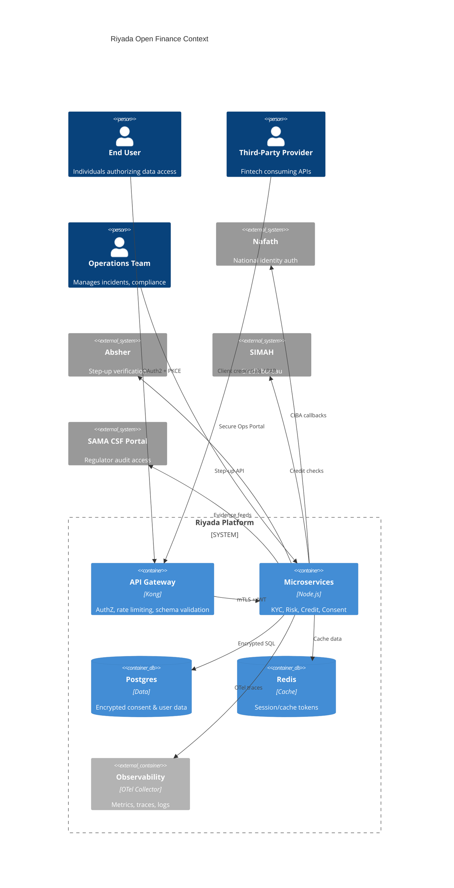
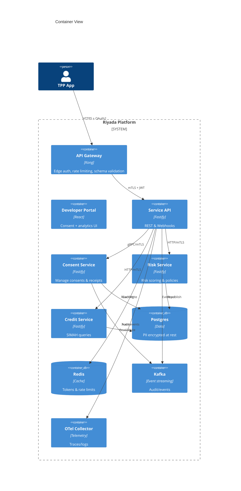
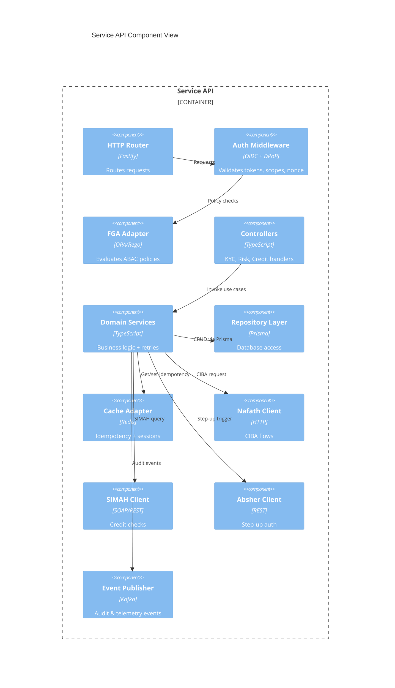
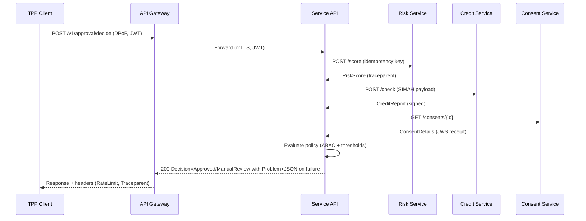

# Riyada Open Finance Architecture

## ASCII Context Diagram (C4 Level 1)
```
+-----------------------------------------------------------+
|                      External Actors                      |
|                                                           |
|  [Consumer Apps]  [TPP Platforms]  [Internal Ops Portal]  |
|           \             |                /                |
+------------\------------|---------------/-----------------+
             \            |              /
              v           v             v
        +---------------------------------------+
        |        Riyada Open Finance Platform   |
        | (API Gateway + Services + Datastores) |
        +---------------------------------------+
              ^           ^             ^
             /            |              \
            /             |               \
+----------/--------------|----------------\------------+
|   External Services     |      Regulators |  Identity  |
| [Nafath] [Absher] [SIMAH] [SAMA/SDAIA SIEM] [Bank APIs] |
+---------------------------------------------------------+
```

## Mermaid Context Diagram


## Container Diagram (C4 Level 2)


## Component Diagram (C4 Level 3 – Service API)


## Sequence Diagram – Auto Approval Decision

