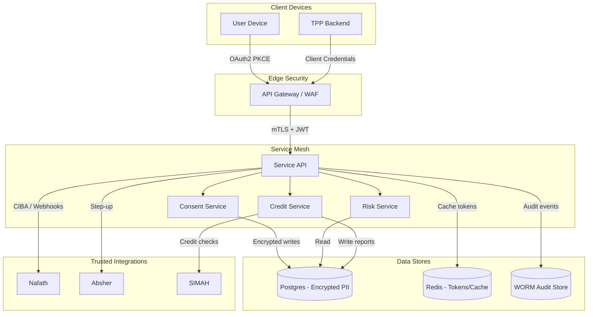

# Data Flow & Privacy Mapping

## Data Flow Diagram (Trust Boundaries)

## PII Field Inventory

| Data Asset | Classification | Fields | Purpose | Lawful Basis | Retention | Notes |
|------------|----------------|--------|---------|--------------|-----------|-------|
| Postgres `users` | Restricted | full_name, national_id, dob, email, phone | Account identification, consent tracking | Consent + Legitimate interest (PDPL Art. 5) | 5 years post account closure | National ID stored encrypted, masked in logs. |
| Postgres `kyc_records` | Restricted | document_number, document_type, kyc_status, pep_flag, sanctions_flag | Regulatory KYC compliance | Legal obligation | 10 years per SAMA | Access limited via RLS. |
| Postgres `credit_checks` | Restricted | simah_score, delinquency_count, exposure_sar | Credit decisioning | Consent | 3 years | Aggregated for analytics via anonymized views. |
| Redis cache | Confidential | session tokens, nonce, rate limit counters | Performance, replay protection | Legitimate interest | 24 hours | Tokens salted, hashed. |
| Audit store | Confidential | actor_id, action, consent_id, trace_id | Accountability & compliance | Legal obligation | 7 years (immutable) | Stored in WORM S3 bucket. |

## Data Subject Rights
- `GET /v1/me/data/export` – exports JSON bundle zipped and signed (JWS).
- `DELETE /v1/me/data` – triggers deletion workflow, marks records for crypto-shred.
- `GET /v1/me/consents` – lists consents with ability to revoke.
- Requests logged with request_id, processed via workflow engine. SLA: acknowledge ≤7 days, fulfill ≤30 days.

## Cross-Border Policy
- Primary region: AWS me-central-1; failover: eu-central-1 with encrypted replication.
- Cross-border transfers require DPO-approved Data Transfer Agreement; encryption keys remain in KSA HSM.
